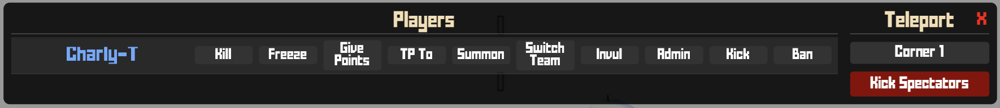
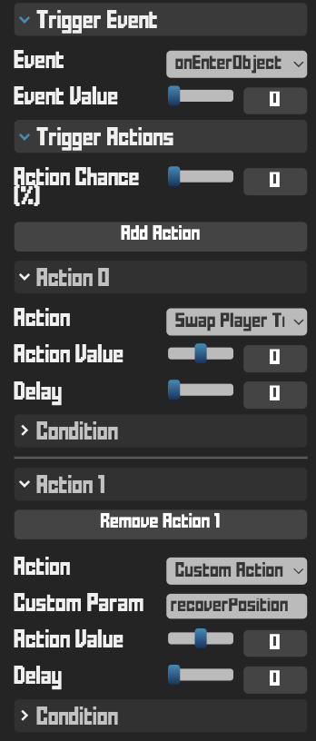

# Krunker Admin Panel

Admin panel for managing players in Krunker custom maps. Clickable UI with real-time state synchronization between admins.

---

## Screenshots



---

## Features

### Panel UI
- **Open/Close**: Press `0` to open the admin panel. Click outside the panel or over the close button to close it.
- **Two-column layout**: Left column shows players with action buttons, right column shows points of interest to teleport and utility buttons.
- **Team colors**: Player names are colored by team (blue = team 1, red = team 2).
- **State indicators**: Freeze, Invul, and Admin buttons turn green when active on a player.

### Player Actions
| Action | Description |
|--------|-------------|
| **Kill** | Instantly eliminate a player |
| **Freeze** | Toggle movement lock on a player |
| **Give Points** | Award 500 points to a player |
| **TP To** | Teleport yourself to a player |
| **Summon** | Bring a player to your location |
| **Switch Team** | Move a player to the other team (requires trigger zones) |
| **Invul** | Toggle invulnerability on a player |
| **Admin** | Grant/revoke soft-admin privileges to a player |
| **Kick** | Remove a player from the game |
| **Ban** | Permanently ban a player |

### Utility Actions (Right Column)
- **Teleport to POI**: Click any Point of Interest to teleport there.
- **Kick Spectators**: Kicks the players that haven't spawned yet.

---

## Setup

### As a Map Maker
1. If you dont have any code in your scripts, copy the contents of `client.krnk` and `server.krnk` into your map's respective script files and skip to step 3.
2. If you already have code:
- On client: copy the lines from 1 to 277. Then add the handlers: `handleAdminStart()` inside the `start` action, `handleAdminKeyPress(key)` inside the `onKeyPress` action, `handleAdminDIVClicked(id)` inside the `onDIVClicked` action, and `handleAdminNetworkMessage(id, data, playerID)` inside the `onNetworkMessage` action.
- On server: copy the lines from 1 to 183. Then add the handlers: `handleAdminPlayerSpawn(id)` on the `onPlayerSpawn` action, `handleAdminPlayerDamage(id)` on the `onPlayerDamage` action, `handleAdminCustomTrigger(playerID, customParam, value)` on the `onCustomTrigger` action, and `handleAdminNetworkMessage(id, data, playerID)` on the `onNetworkMessage` action.
3. Edit `admin.poi` in `client.krnk` to define teleport locations:
   ```krnk
   poi: obj[{
       name: 'Spawn Point',
       position: { x: 0, y: 0, z: 0 }
   }, {
       name: 'Sniper Tower',
       position: { x: 100, y: 50, z: 100 }
   }],
   ```
4. Edit `admin.players` in `server.krnk` to set hardcoded admin usernames.
5. For **Switch Team** to work, place two triggers somewhere in your map and copy their coordinates to `admin.changeTeamLocations` positions. Those triggers should have `onEntryObject` event, swap-team action, and `recoverPosition` custom param.


A working `map.json` is included in the repository for testing.

### As a Map Admin
1. Press `0` to open the panel.
2. Click buttons next to player names to perform actions.
3. Green-highlighted buttons (Freeze/Invul/Admin) indicate active states.
4. Use the right column to teleport to POIs.

---

## Configuration

All configuration lives inside the `admin` object in each file:

| Property (server) | Description |
|---|---|
| `admin.players` | Hardcoded admin usernames |
| `admin.changeTeamLocations` | Trigger positions for team switch |

| Property (client) | Description |
|---|---|
| `admin.toggleKey` | Key to open/close panel (default: `'0'`) |
| `admin.poi` | Array of teleport locations |
| `admin.options` / `admin.labels` | Action IDs and their display labels |
